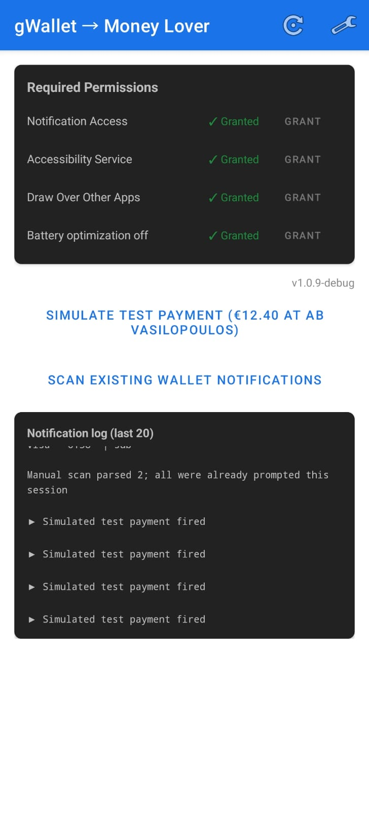
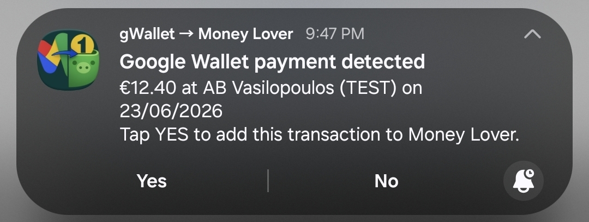
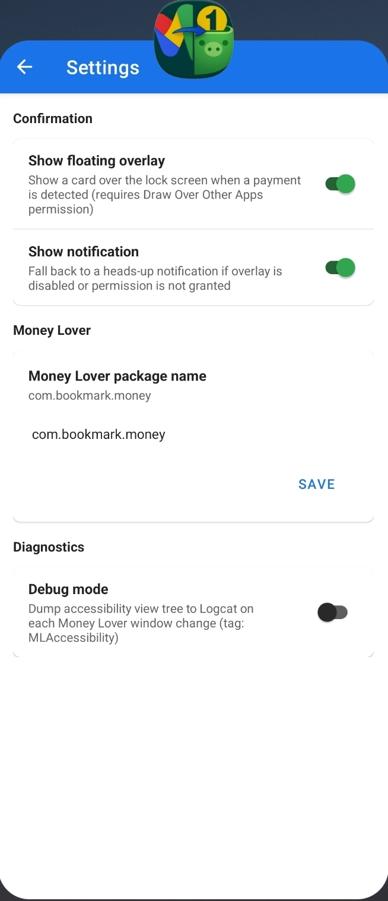
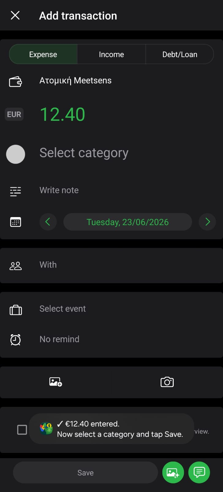

# gWallet2MoneyLover - Android app 

Android automation app that detects Google Wallet payment notifications and helps enter the payment amount into Money Lover Premium.

The app listens for Google Wallet notifications, parses the payment amount and merchant, asks for a single confirmation, opens Money Lover, and uses an Accessibility Service to fill the amount on the Add Transaction screen. It intentionally stops before category selection, so the user remains in control of category, notes, and final save.

## Screenshots

### Main Dashboard

The main screen shows permission status, test/scanning actions, app version, and a debug notification log.



### Payment Confirmation Notification

When a Google Wallet payment is detected, the app shows a notification prompt. Pressing `Yes` now goes directly to Money Lover and starts the automation.



### Settings

The settings page controls the confirmation UI, Money Lover package name, and diagnostics.



### Money Lover Amount Filled

After confirmation, Money Lover opens on Add Transaction and the amount is entered automatically. The user then selects a category and taps Save.



## What It Does

- Monitors Google Wallet payment notifications.
- Parses amount, currency, merchant, and timestamp from notification title/text.
- Supports the observed real Google Wallet format, for example:
  - title: `COSMOS SPORT`
  - text: `EUR 29.32 with Credit Visa ...`
- Shows a confirmation prompt via:
  - floating overlay, when overlay permission is granted and enabled
  - heads-up notification fallback
- Opens Money Lover Premium after the user presses `Yes`.
- Uses Android Accessibility gestures to tap Money Lover's custom numeric keypad.
- Enters only the amount, then stops before category selection.
- Provides a manual scan button for already-visible Wallet notifications.
- Includes a debug log of Wallet notifications and parser results.

## Current User Flow

1. A Google Wallet payment notification appears.
2. gWallet2MoneyLover parses the notification.
3. The app prompts the user with `Yes` / `No`.
4. User presses `Yes`.
5. Money Lover opens directly.
6. The Accessibility Service taps the Money Lover `+` flow and fills the amount.
7. The user chooses category/details and saves manually.

There is no longer a second intermediate approval popup after pressing `Yes`.

## Manual Scan For Existing Notifications

The `Scan existing Wallet notifications` button checks notifications that are already visible in the notification shade.

This is useful when:

- the app was installed after the payment notification arrived
- notification access was disabled at the time of payment
- you want to retry parsing active Wallet notifications

If multiple active payment notifications are found, the app prompts one at a time, newest first, across repeated scan button presses. This avoids overwriting the single pending transaction slot.

## Permissions

The app needs several Android permissions/features to work end to end.

### Notification Access

Required to read Google Wallet notifications. Without this, new Wallet notifications cannot be detected and active notification scanning cannot work.

### Accessibility Service

Required to automate Money Lover. The service does not save transactions by itself; it fills the amount and stops before category/save.

### Draw Over Other Apps

Required only for the floating overlay confirmation UI. If disabled, the app can fall back to notification confirmation.

### Battery Optimization Exemption

Recommended on Samsung and other aggressive Android builds so the notification listener is not killed in the background.

### Post Notifications

Required on Android 13+ so the app can show its own payment confirmation notification.

## Settings

The settings screen includes:

- `Show floating overlay`
  Enables or disables the overlay confirmation prompt.

- `Show notification`
  Enables or disables the notification fallback.

- `Money Lover package name`
  Defaults to `com.bookmark.money`.

- `Debug mode`
  Dumps Money Lover accessibility view trees to Logcat with tag `MLAccessibility`.

Screenshot: [settings-page.png](docs/screenshots/settings-page.png)

## Money Lover Support

The app is currently designed for Money Lover Premium:

```text
com.bookmark.money
```

Money Lover uses a custom numeric keypad. Standard Accessibility click/text actions may report success but not actually input values, so the app uses `dispatchGesture()` touch gestures instead.

## Google Wallet Support

The notification listener watches common Google Wallet / payment-related packages:

- `com.google.android.apps.walletnfcrel`
- `com.google.android.apps.wallet`
- `com.google.android.gms`
- `com.google.android.apps.nfc.payment`
- `com.samsung.android.spay`

The parser supports several amount formats, including:

- `EUR 12.40 at Merchant`
- `You paid EUR 12.40 at Merchant`
- `Payment of EUR 12.40 to Merchant`
- `EUR 12.40 - Merchant`
- `12,40 EUR at Merchant`
- `EUR 29.32 with Credit Visa ...` with merchant taken from the notification title

Currency-symbol examples in the actual Android notifications are parsed as their native symbols.

## Build

Debug build:

```powershell
$env:JAVA_HOME='C:\Program Files\Android\Android Studio\jbr'
$env:Path="$env:JAVA_HOME\bin;$env:Path"
.\gradlew.bat assembleDebug
```

Generated APKs include the version in the filename:

```text
app/build/outputs/apk/debug/gWallet2MoneyLover-v1.0.10-debug.apk
```

Release builds follow the same naming style:

```text
gWallet2MoneyLover-v<version>.apk
```

## Project Structure

```text
app/src/main/kotlin/com/iridalabs/gwallet2moneylover/
  accessibility/   Money Lover automation service
  automation/      Shared Money Lover launch flow
  data/            Payment model, app settings, pending transaction store
  notification/    Notification listener, parser integration, app notifications
  overlay/         Floating confirmation overlay
  parser/          Google Wallet notification parser
  receiver/        Notification Yes/No action receiver
  ui/              Main, settings, and fallback confirmation screens
```

## Troubleshooting

### New payments are not detected

- Check Notification Access is granted.
- Toggle Notification Access off and on if Android keeps the old listener instance alive.
- Check the debug log on the main screen.
- Use `Scan existing Wallet notifications` if the payment notification is still visible.

### Pressing Yes does not open Money Lover

- Confirm Money Lover Premium is installed.
- Confirm the package name in settings is `com.bookmark.money`.
- Confirm the Accessibility Service is running.

### Amount is not filled

- Disable and re-enable the Accessibility Service after installing a new APK.
- Enable Debug mode and inspect Logcat tag `MLAccessibility`.
- Check whether Money Lover changed its Add Transaction screen layout.

### The settings page looks blank

This was fixed in v1.0.10 by replacing the preference screen with explicit native views and text colors.

## Privacy And Safety Notes

- The app reads Wallet notifications only through Android's Notification Listener permission.
- It stores a single pending payment locally in SharedPreferences.
- It does not upload data.
- It does not automatically save transactions in Money Lover.
- The user must explicitly press `Yes` before Money Lover is opened and automated.

## Tested Devices

- Samsung Galaxy Z Fold 7 (Android version 16, One UI version 8.5)

## Disclaimer

This is an independent personal automation tool. It is not affiliated with Google Wallet, Google, Money Lover, or Finsify.
